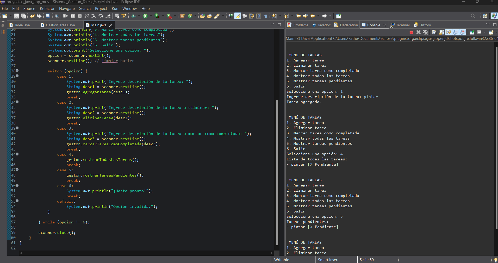

**_<h1 align="center">:vulcan_salute: Sistema de Gestión de Tareas :computer:</h1>_**

**<h3>:blue_book: Contexto:</h3>**

- En el contexto actual, muchas aplicaciones y herramientas se utilizan para gestionar tareas diarias, tanto personales como profesionales.
- Se te ha asignado el desarrollo de una aplicación de consola en Java para gestionar tareas.
- Esta aplicación permitirá a los usuarios agregar, eliminar, marcar como completadas y listar tareas pendientes. Además, se requiere que sigas buenas prácticas de codificación, como el uso de convenciones de estilo de código en Java, la documentación adecuada del código con Javadoc, y la depuración a través de un IDE.
- La aplicación debe ser interactiva, permitiendo al usuario seleccionar diferentes opciones desde un menú de consola y debe gestionar las tareas de manera eficiente.
- El objetivo principal de esta actividad es aplicar conceptos sobre construcción de aplicaciones en consola siguiendo estándares y convenciones de código en Java, depuración de programas y documentación de código.

**<h3>:orange_book: Objetivo:</h3>**

- Desarrollar una aplicación de consola en Java para gestionar tareas pendientes.
El sistema debe permitir al usuario realizar las siguientes operaciones:
1. Agregar tareas a una lista.
2. Eliminar tareas de la lista.
3. Marcar tareas como completadas.
4. Mostrar todas las tareas (completadas y pendientes).
5. Mostrar solo las tareas pendientes.
- La aplicación debe seguir convenciones y buenas prácticas de codificación, utilizando el formato adecuado de nombres, documentación con Javadoc, y asegurando la estructura clara y legible del código.

**<h3>:green_book: Instrucciones:</h3>**

1. Estructura de Datos y Clases:
- Crea una clase Tarea con los siguientes atributos:
- => Descripción (String): Descripción breve de la tarea.
- => Completada (boolean): Indica si la tarea está completada o no.
- Crea una clase GestionTareas que contendrá los métodos y operaciones del sistema, como agregar, eliminar y listar las tareas.

2. Operaciones Básicas:
- Agregar Tarea: Implementa un método que permita agregar una nueva tarea a la lista. La tarea debe tener una descripción y se debe agregar al arreglo de tareas con el estado inicial de no completada.
- Eliminar Tarea: Implementa un método que permita eliminar una tarea de la lista utilizando su descripción. Si la tarea no existe, debe mostrar un mensaje indicando que no se encontró.
- Marcar Tarea como Completada: Implementa un método que permita marcar una tarea como completada. Esta acción debe cambiar el valor del atributo completada de la tarea correspondiente a true.
- Mostrar Todas las Tareas: Implementa un método que recorra todas las tareas y las muestre, indicando si están completadas o no.
- Mostrar Tareas Pendientes: Implementa un método que recorra y muestre únicamente las tareas que aún no han sido completadas.

3. Manejo de Entrada y Salida:
- Crea un menú interactivo en consola con las siguientes opciones:
- => Agregar tarea.
- => Eliminar tarea.
- => Marcar tarea como completada.
- => Mostrar todas las tareas.
- => Mostrar solo tareas pendientes.
- => Salir.

4. Requerimientos de Implementación:
- A. Buenas Prácticas y Convenciones de Codificación:
  - Nombres de Variables y Métodos: Utiliza nombres descriptivos y sigue las convenciones estándar de Java, como el uso de camelCase para nombres de variables y métodos, y PascalCase para nombres de clases.
  - Indentación y Espaciado: Asegúrate de seguir una buena indentación y espaciado para mejorar la legibilidad del código.
  - Documentación con Javadoc: Cada clase, método y atributo debe estar adecuadamente documentado utilizando Javadoc para describir su propósito, parámetros y valor de retorno.
- B. Estructuras Condicionales y Repetitivas:
  - Usar sentencias condicionales (if-else) para verificar si una tarea existe al eliminarla o marcarla como completada.
  - Usar bucles (for o while) para recorrer las listas de tareas y mostrarlas al usuario.
- C. Arreglos y Colecciones:
  - Utiliza un arreglo o lista para almacenar las tareas.
  - El tamaño de la lista debe ser dinámico en función de la cantidad de tareas (considera usar un arreglo de tamaño fijo para simplificar el ejercicio).
- D. Manejo de Excepciones:
  - Asegúrate de manejar posibles errores, como intentar eliminar una tarea que no existe o marcar una tarea que ya está completada.
- E. Depuración:
  - Utiliza el IDE para depurar el código, asegurándote de que todas las funcionalidades del programa funcionen correctamente antes de completar el ejercicio.

**<h3>:blue_book: Desarrollo del Programa:</h3>**

- 1. Clase Tarea: Define los atributos y métodos para manejar los datos de las tareas.
 - La clase debe incluir los atributos mencionados y un constructor para inicializarlos.
 - Crear métodos para cambiar el estado de la tarea (marcar como completada) y mostrar su estado.
- 2. Clase GestionTareas: Gestiona el sistema de tareas.
 - Crea un arreglo de objetos Tarea[] para almacenar las tareas. Este arreglo debe permitir agregar nuevas tareas y eliminar tareas existentes.
 - Implementar métodos para agregar, eliminar, marcar como completada, y mostrar las tareas.
 - Implementar un menú que permita al usuario seleccionar las operaciones que desea realizar.
3. Clase Principal (Main): Configura y ejecuta el sistema.
- Crea un objeto de la clase GestionTareas.
- Mostrar un menú con las opciones disponibles.
- Ejecutar los métodos de la clase GestionTareas según la opción seleccionada por el usuario.

**<h3>:book: Ejemplo de Salida:</h3>**

